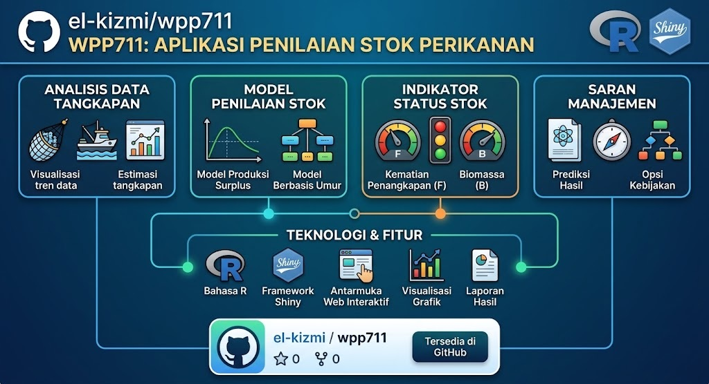

# Batch cMSY++ Stock Assessment

Aplikasi **Shiny/R** untuk analisis kesehatan stok ikan secara batch menggunakan metode **CMSY++** (Collapsed and Maximum Sustainable Yield). Aplikasi ini hanya mengembangkan **antarmuka (interface)** — kode inti CMSY++ tidak diubah dari versi aslinya.



---

## Daftar Isi

- [Tentang Project](#tentang-project)
- [Fitur Utama](#fitur-utama)
- [Arsitektur Sistem](#arsitektur-sistem)
- [Persiapan Lingkungan](#persiapan-lingkungan)
- [Cara Penggunaan](#cara-penggunaan)
- [Format Data Input](#format-data-input)
- [Alur Kerja Wizard](#alur-kerja-wizard)
- [Jalankan via CLI](#jalankan-via-cli)
- [Struktur Project](#struktur-project)
- [Pengembangan & Testing](#pengembangan--testing)
- [Risiko & Catatan Metodologis](#risiko--catatan-metodologis)
- [Referensi](#referensi)
- [Deploy ke Oracle Cloud](#deploy-ke-oracle-cloud)

---

## Tentang Project

Aplikasi ini dirancang untuk memproses **analisis stok multi-spesies secara paralel**. Aplikasi ini mengintegrasikan:

- **CMSY++** — model Bayesian Schaefer yang dikembangkan oleh Rainer Froese, Gianpaolo Coro, dan Henning Winker (2016, diperbarui 2021) dengan implementasi JAGS
- **Standardisasi CPUE** — metode Delta-Gamma GLM untuk mengolah data operasi penangkapan mentah menjadi indeks kelimpahan tahunan
- **Antarmuka Wizard** — 7 langkah terstruktur (Import → Indeks → Validasi → Parameter → Proses → Hasil → Ringkasan)
- **Pelaporan kelompok** — pengelompokan spesies berdasarkan komoditas dengan narasi otomatis berbahasa Indonesia

> **Pernyataan Penting:** Repository ini hanya mengembangkan **antarmuka (interface)** untuk penggunaan CMSY++ tanpa mengubah kode asal. Kode inti CMSY++ (`engine/CMSY++16.R`) berasal dari repo [SISTA16/cmsyPlusPlus](https://github.com/SISTA16/cmsyPlusPlus) dan tidak dimodifikasi secara substantif. Untuk pemahaman tentang metode CMSY++, silakan baca: [*New developments in the analysis of catch time series as the basis for fish stock assessments: The CMSY++ method*](https://www.sciencedirect.com/org/science/article/pii/S0137159223000080) (Froese et al., 2023).

---

## Fitur Utama

| Fitur | Deskripsi |
|---|---|
| **Batch Processing** | Analisis puluhan spesies dalam satu sesi dengan paralelisasi process |
| **4 Mode Indeks Kelimpahan** | Catch-only CMSY, Standardisasi CPUE Internal, CPUE Eksternal, Biomassa Absolut |
| **Standardisasi CPUE** | Delta-Gamma GLM dengan kovariat opsional (alat tangkap, GT, musim, wilayah) |
| **Validasi 12+ Pemeriksaan** | Tahun, kontinuitas, catch > 0, panjang seri, prior, tipe abundance, duplikat |
| **Parameter Preset** | Conservative, Standard, Fast — satu klik untuk set parameter |
| **Override Per-Spesies** | CV Catch, CV CPue, sigmaR, chains, iterasi, e.creep, force_cmsy |
| **Visualisasi Otomatis** | Analysis Plot, Management Plot, Kobe Plot per spesies |
| **Ringkasan Kelompok** | Total MSY, B/Bmsy, F/Fmsy, distribusi status, narasi otomatis |
| **Ekspor Hasil** | CSV per spesies dan per kelompok |
| **CLI Headless** | `run_batch_cli.R` untuk eksekusi non-interaktif dan reproduktibel |
| **Audit Otomatis** | `audit_completed_run.R` untuk memeriksa kualitas run |

---

## Arsitektur Sistem

```
app_batch.R (Entry Point)
│
├── mod_batch_import   ──→ catch_df, id_df, groups, species_list
│       │
│       ▼
├── mod_batch_cpue     ──→ analysis_catch (dengan bt), btype, recommended_cv
│       │                  (menggunakan cpue_helpers.R)
│       ▼
├── mod_batch_validate ──→ all_passed, hasil validasi per stok
│       │                  (menggunakan batch_helpers.R: validate_single_stock)
│       ▼
├── mod_batch_params   ──→ parameter global + override per spesies
│       │
│       ▼
├── mod_batch_run      ──→ menjalankan CMSY++ secara paralel, mengumpulkan hasil
│       │                  (menggunakan cmsy_runner.R: run_cmsy_job, parse_cmsy_output)
│       ▼
├── mod_batch_results  ──→ browser per stok dengan plot & metrik
│       │                  (menggunakan batch_helpers.R: classify, color, icon)
│       ▼
└── mod_batch_summary  ──→ kartu kelompok, boxplot, narasi, ekspor CSV
                          (menggunakan batch_helpers.R: compute_group_stats, narrative)
```

### Alur Data

1. **Import** — Pengguna mengunggah CSV tangkapan (`Stock,yr,ct`) dan CSV metadata (`Stock,Group,Resilience,...`)
2. **CPUE** — Secara opsional menstandarisasi data operasi mentah → indeks kelimpahan tahunan (kolom `bt`)
3. **Validasi** — 12+ pemeriksaan per stok (rentang tahun, catch > 0, validitas prior, dll.)
4. **Parameter** — Setelan MCMC global + override per spesies
5. **Proses** — Setiap stok dijalankan CMSY++-nya dalam proses R terpisah (paralel via `processx`)
6. **Hasil** — Parse output `Out_*.csv` → B/Bmsy, F/Fmsy, MSY, r, k, confidence interval 95%
7. **Ringkasan** — Agregasi per kelompok → total MSY, distribusi status, narasi berbahasa Indonesia

---

## Persiapan Lingkungan

### Prasyarat

- **R** ≥ 4.0 (tes dilakukan pada R 4.6.0)
- **JAGS** (Just Another Gibbs Sampler) — untuk MCMC
- **GitHub CLI** (opsional) — untuk autentikasi

### Paket R yang Dibutuhkan

Paket disimpan di folder `R_library/` (bundled) untuk reproducibilitas:

**Untuk Shiny App:**
`shiny`, `shinyjs`, `bslib`, `DT`, `processx`, `zip`, `readr`, `shinyvalidate`

**Untuk CMSY++ Engine:**
`R2jags`, `coda`, `parallel`, `foreach`, `doParallel`, `gplots`, `mvtnorm`, `snpar`, `neuralnet`, `conicfit`, `pracma`, `geigen`, `LNPar`

### Instalasi

```powershell
# Clone repository
git clone https://github.com/el-kizmi/wpp711.git
cd wpp711

# Jalankan aplikasi Shiny
& 'C:\Program\R\R-4.6.0\bin\Rscript.exe' -e "shiny::runApp('app_batch.R')"
```

Jika paket belum terinstal di `R_library/`, jalankan:

```powershell
& 'C:\Program\R\R-4.6.0\bin\Rscript.exe' -e "
  pkgs <- c('shiny','shinyjs','bslib','DT','processx','zip','readr','shinyvalidate',
            'R2jags','coda','foreach','doParallel','gplots','mvtnorm','snpar',
            'neuralnet','conicfit','pracma','geigen','LNPar')
  install.packages(pkgs[!pkgs %in% installed.packages()], lib='R_library', repos='https://cran.r-project.org')
"
```

---

## Cara Penggunaan

### Melalui Antarmuka Shiny

1. Jalankan aplikasi
2. Ikuti wizard 7 langkah:
   - **1. Import** — Unggah CSV tangkapan dan CSV metadata stok
   - **2. Indeks Kelimpahan** — Pilih mode: catch-only, standarisasi CPUE, atau eksternal
   - **3. Validasi** — Periksa kesiapan data setiap stok
   - **4. Parameter** — Atur setelan MCMC dan override per spesies
   - **5. Proses** — Jalankan analisis CMSY++ secara paralel
   - **6. Hasil** — Telusuri hasil per spesies (status, metrik, plot)
   - **7. Ringkasan** — Lihat ringkasan per kelompok dengan narasi

### Melalui CLI (Headless)

```powershell
& 'C:\Program\R\R-4.6.0\bin\Rscript.exe' scripts\run_batch_cli.R `
  --catch=batch_catch_pelagis.csv `
  --id=batch_id_pelagis.csv `
  --catch-unit=kg `
  --max-parallel=3 `
  --chains=2 `
  --retros=true `
  --plots=false
```

**Opsi CLI:**

| Parameter | Default | Deskripsi |
|---|---|---|
| `--catch` | (wajib) | Path CSV tangkapan |
| `--id` | (wajib) | Path CSV metadata stok |
| `--catch-unit` | `kg` | Satuan catch (kg atau ton) |
| `--max-parallel` | `3` | Maksimal proses paralel |
| `--chains` | `2` | Jumlah chain MCMC |
| `--prior-draws` | `5000` | Jumlah prior draws |
| `--mcmc-iter` | `60000` | Iterasi MCMC |
| `--mcmc-burnin` | `30000` | Burn-in MCMC |
| `--mcmc-thin` | `10` | Thinning interval |
| `--retros` | `true` | Aktifkan retrospektif |
| `--plots` | `false` | Simpan plot JPG |
| `--stocks` | (semua) | Filter spesies tertentu |

### Audit Run

```powershell
& 'C:\Program\R\R-4.6.0\bin\Rscript.exe' scripts\audit_completed_run.R runs\<run_id>
```

---

## Format Data Input

### CSV Tangkapan (Catch)

| Kolom | Tipe | Keterangan |
|---|---|---|
| `Stock` | character | Nama stok (snake_case, contoh: `Katsuwonus_pelamis_711`) |
| `yr` | integer | Tahun (1950–2030) |
| `ct` | numeric | Tangkapan total (kg atau ton) |
| `bt` | numeric | Biomassa/CPUE (opsional, NA jika tidak ada) |

**Contoh:**
```csv
Stock,yr,ct,bt
Katsuwonus_pelamis_711,2005,150000,NA
Katsuwonus_pelamis_711,2006,165000,NA
Katsuwonus_pelamis_711,2007,142000,NA
```

### CSV Metadata Stok (ID)

| Kolom | Tipe | Keterangan |
|---|---|---|
| `Stock` | character | Nama stok (harus cocok dengan CSV tangkapan) |
| `Group` | character | Kelompok komoditas (contoh: `Large Pelagics`) |
| `Name` | character | Nama umum spesies |
| `ScientificName` | character | Nama ilmiah |
| `Resilience` | character | `High`, `Medium`, `Low`, atau `Very low` |
| `r.low` / `r.hi` | numeric | Batas bawah/atas laju pertumbuhan r (opsional) |
| `stb.low` / `stb.hi` | numeric | B/k awal (opsional) |
| `int.yr` | integer | Tahun intermediate (opsional) |
| `intb.low` / `intb.hi` | numeric | B/k intermediate (opsional) |
| `endb.low` / `endb.hi` | numeric | B/k akhir (opsional) |
| `btype` | character | `None` (catch-only), `CPUE`, atau `biomass` |
| `e.creep` | numeric | Koreksi effort creep (% per tahun, opsional) |
| `force.cmsy` | logical | Paksa CMSY meski ada CPUE |

### CSV CPUE Mentah (untuk Standardisasi Internal)

| Kolom | Tipe | Keterangan |
|---|---|---|
| `Stock` | character | Nama stok |
| `yr` | integer | Tahun |
| `nama_alat_tangkap` | character | Jenis alat tangkap |
| `jumlah_hari_operasi` | numeric | Jumlah hari operasi |
| `gt_kapal` | numeric | Gross tonnage kapal |
| `berat_ikan_kg` | numeric | Berat tangkapan (kg) |
| `musim` | character | Musim (opsional) |
| `wilayah` | character | Wilayah (opsional) |

### Template

Template tersedia di folder `templates/`:
- `batch_catch_template.csv` — Contoh data tangkapan untuk stok WPP-711
- `batch_id_template.csv` — Contoh metadata stok
- `cpue_raw_template.csv` — Contoh data operasi mentah

---

## Alur Kerja Wizard

### Langkah 1: Import
- Unggah CSV tangkapan dan CSV metadata via drag-and-drop
- Download template kosong jika belum punya data
- Pratinjau data dan deteksi kelompok spesies otomatis

### Langkah 2: Indeks Kelimpahan
Empat mode tersedia:

| Mode | Keterangan | Kapan Digunakan |
|---|---|---|
| **Catch-only CMSY** | Tanpa indeks kelimpahan | Data tangkapan saja |
| **CPUE Internal** | Upload data operasi mentah, standardisasi otomatis | Ada data trip/harian |
| **CPUE Eksternal** | Upload indeks yang sudah distandarisasi | Sudah punya indeks |
| **Biomassa Absolut** | Upload data biomassa langsung | Survey biomass tersedia |

### Langkah 3: Validasi
- 12+ pemeriksaan otomatis per stok
- Badge Pass/Warning/Error
- Filter untuk menampilkan stok bermasalah

### Langkah 4: Parameter
- **Preset**: Conservative (lebih banyak iterasi), Standard, Fast
- Atur: chains, prior draws, CV Catch, CV CPue, SigmaR, bandwidth
- Override parameter per spesies jika diperlukan

### Langkah 5: Proses
- Progress grid real-time (pending/running/done/error)
- Console output per stok
- Timer elapsed
- Tombol Cancel untuk menghentikan semua proses

### Langkah 6: Hasil
- Browser per spesies dengan navigasi prev/next
- Status bar: nama stok, badge status, level kepercayaan
- Metrik: MSY, B/Bmsy, F/Fmsy, r, k (dengan CI 95%)
- Plot: Analysis, Management, Kobe

### Langkah 7: Ringkasan
- Kartu per kelompok: Total MSY, Median B/Bmsy, Median F/Fmsy, distribusi status
- Tabel status semua stok dengan pewarnaan
- Boxplot perbandingan antar kelompok
- Narasi otomatis berbahasa Indonesia
- Ekspor CSV

---

## Jalankan via CLI

### Eksekusi Batch Non-Interaktif

```powershell
& 'C:\Program\R\R-4.6.0\bin\Rscript.exe' scripts\run_batch_cli.R `
  --catch=batch_catch_pelagis.csv `
  --id=batch_id_pelagis.csv `
  --catch-unit=kg `
  --max-parallel=3 `
  --chains=2 `
  --retros=true
```

Output tersimpan di folder `runs/<timestamp>/`:
- `batch_status.csv` — Status setiap stok
- `batch_results.csv` — Hasil ringkas semua stok
- `runs/<stock>/` — Folder per stok berisi CSV output, log, plot

### Audit Kualitas Run

```powershell
& 'C:\Program\R\R-4.6.0\bin\Rscript.exe' scripts\audit_completed_run.R runs\<run_id>
```

Output:
- `audit_quality.csv` — Metrik kualitas per stok
- `audit_summary.txt` — Ringkasan kualitas

---

## Struktur Project

```
wpp711/
├── app_batch.R                    # Entry point Shiny app
├── engine/
│   ├── CMSY++16.R                 # Engine CMSY++ (Froese, Coro, Winker)
│   └── ffnn.bin                   # File neural network untuk B/k prior
├── R/
│   ├── batch_helpers.R            # Fungsi utilitas: klasifikasi, validasi, narasi
│   ├── cpue_helpers.R             # Standardisasi CPUE Delta-Gamma GLM
│   ├── cmsy_runner.R              # Launcher CMSY++ via processx
│   ├── mod_batch_import.R         # Modul: Import data
│   ├── mod_batch_cpue.R           # Modul: Indeks kelimpahan
│   ├── mod_batch_validate.R       # Modul: Validasi data
│   ├── mod_batch_params.R         # Modul: Parameter MCMC
│   ├── mod_batch_run.R            # Modul: Eksekusi paralel
│   ├── mod_batch_results.R        # Modul: Browser hasil per stok
│   ├── mod_batch_summary.R        # Modul: Ringkasan kelompok
│   └── mod_how_to_use.R           # Modul: Panduan penggunaan
├── scripts/
│   ├── run_batch_cli.R            # Runner CLI headless
│   └── audit_completed_run.R      # Audit kualitas run
├── templates/
│   ├── batch_catch_template.csv   # Template CSV tangkapan
│   ├── batch_id_template.csv      # Template CSV metadata stok
│   └── cpue_raw_template.csv      # Template CSV operasi mentah
├── tests/
│   ├── test_cpue_engine.R         # Test: CPUE → engine end-to-end
│   ├── test_cpue_pipeline.R       # Test: unit standardisasi CPUE
│   ├── test_import_module.R       # Test: modul import
│   ├── test_pipeline.R            # Test: pipeline inti
│   ├── test_results_module.R      # Test: modul hasil
│   └── test_summary_module.R      # Test: modul ringkasan
├── CPUE/
│   ├── standardisasi_cpue_glm_gamma.R  # Skrip standalone CPUE
│   └── data cpue GLM.csv              # Data contoh
├── www/
│   ├── batch.css                  # Stylesheet aplikasi
│   └── custom.js                  # JavaScript kustom
├── R_library/                     # Paket R yang dibundled
├── runs/                          # Output analisis (generated)
├── batch_catch_pelagis.csv        # Data tangkapan contoh WPP-711
├── batch_id_pelagis.csv           # Data metadata contoh WPP-711
├── AUDIT_CMSY_RADIKAL.md          # Dokumentasi audit radikal
└── README.md                      # Dokumentasi ini
```

---

## Pengembangan & Testing

### Menjalankan Semua Test

```powershell
# Unit test pipeline
& 'C:\Program\R\R-4.6.0\bin\Rscript.exe' tests/test_pipeline.R

# Test modul import
& 'C:\Program\R\R-4.6.0\bin\Rscript.exe' tests/test_import_module.R

# Test standardisasi CPUE
& 'C:\Program\R\R-4.6.0\bin\Rscript.exe' tests/test_cpue_pipeline.R

# Test CPUE → Engine end-to-end
& 'C:\Program\R\R-4.6.0\bin\Rscript.exe' tests/test_cpue_engine.R

# Test modul hasil
& 'C:\Program\R\R-4.6.0\bin\Rscript.exe' tests/test_results_module.R

# Test modul ringkasan
& 'C:\Program\R\R-4.6.0\bin\Rscript.exe' tests/test_summary_module.R
```

### Komponen Kunci untuk Pengembangan

| File | Fungsi |
|---|---|
| `R/batch_helpers.R` | Fungsi utilitas inti — klasifikasi status, validasi, narasi |
| `R/cpue_helpers.R` | Mesin standardisasi CPUE Delta-Gamma GLM |
| `R/cmsy_runner.R` | Peluncur CMSY++ via processx |
| `engine/CMSY++16.R` | Engine analisis CMSY++ (jangan edit tanpa pemahaman mendalam) |

---

## Risiko & Catatan Metodologis

### Batasan Dataset

- Seluruh seri catch-only (`btype=None`) — tidak ada indeks kelimpahan aktual
- Tidak ada prior ahli untuk batas r atau biomassa awal/antara/akhir
- 14 seri memiliki lompatan tangkapan tahunan > 10× — wajib verifikasi terhadap perubahan pelaporan, satuan, atau cakupan armada
- Median rasio lebar CI MSY (UCL/LCL) sekitar 1,85 — ketidakpastian tinggi

### Catatan Metodologis

- Penjumlahan MSY per spesies **bukan** MSY ekosistem — tidak boleh langsung dijadikan TAC kelompok tanpa koreksi interaksi, overlap armada, selectivity, dan kualitas pelaporan
- Klasifikasi status menggunakan ambang operasional (termasuk zona 0,8–1,2 B/Bmsy), bukan probabilitas posterior
- Label status diberi `Robust/Uncertain` berdasarkan konsistensi seluruh sudut interval 95%
- Semua hasil bersifat **indikatif** dan harus disertai interval kepercayaan

### Reproduktibilitas

- Paket R dibundled di `R_library/` untuk reproducibilitas
- Seed JAGS tidak di-set secara default (untuk fleksibilitas)
- Setiap run menyimpan artefak lengkap di `runs/` (input snapshot, output, log)

---

## Referensi

- Froese, R., Coro, G., Winker, H. (2023). New developments in the analysis of catch time series as the basis for fish stock assessments: The CMSY++ method. *Journal of Sea Research*. https://doi.org/10.1016/j.seares.2023.102008
- Froese, R., Coro, G., Winker, H. (2021). CMSY++ and BSM: Bayesian biomass and MSY assessment methods. Daur hidup: 2016–2021.
- Martell, S. & Froese, R. (2013). A simple method for estimating MSY from catch and resilience. *Fish and Fisheries* 14: 520–531.

**Kode asal CMSY++:** [SISTA16/cmsyPlusPlus](https://github.com/SISTA16/cmsyPlusPlus)

---

## Deploy ke Oracle Cloud

Aplikasi bisa di-deploy ke **Oracle Cloud Free Tier** (gratis selamanya) menggunakan Docker.

### Langkah 1: Buat Akun Oracle Cloud

1. Buka https://cloud.oracle.com/free
2. Klik **Start for Free**
3. Isi data dan buat akun
4. Pilih **Home Region** terdekat (Singapore atau Tokyo)

### Langkah 2: Buat VM Instance

1. Login ke Oracle Cloud Console
2. Klik **Create a VM Instance**
3. Pilih:
   - **Name:** `wpp711-server`
   - **Image:** Ubuntu 22.04 (atau Debian)
   - **Shape:** VM.Standard.A1.Flex (4 OCPU, 24 GB RAM — gratis)
   - **Public IP:** Assign public IP
4. **SSH Keys:** Upload public key atau generate baru
5. Klik **Create**

### Langkah 3: Setup Firewall

Di Oracle Cloud Console:
1. Klik **Networking** → **Virtual Cloud Networks** → pilih VCN
2. Klik **Security Lists** → **Default Security List**
3. Tambah **Ingress Rules:**
   - **Source CIDR:** `0.0.0.0/0`
   - **Destination Port:** `3838`
   - **Protocol:** TCP

### Langkah 4: Connect ke VM

```powershell
ssh -i your-key.pem ubuntu@<PUBLIC_IP>
```

### Langkah 5: Deploy Aplikasi

```bash
# Jalankan satu perintah ini:
bash <(curl -s https://raw.githubusercontent.com/el-kizmi/wpp711/master/deploy.sh)
```

Atau manual:

```bash
# Install Docker
curl -fsSL https://get.docker.com | sudo bash
sudo usermod -aG docker $USER

# Clone repo
sudo git clone https://github.com/el-kizmi/wpp711.git /opt/wpp711
cd /opt/wpp711

# Build & run
sudo docker-compose up -d --build

# Buka firewall
sudo ufw allow 3838/tcp
```

### Langkah 6: Akses Aplikasi

Buka browser:
```
http://<PUBLIC_IP>:3838
```

### Perintah Berguna

| Perintah | Fungsi |
|---|---|
| `sudo docker-compose logs -f` | Lihat log real-time |
| `sudo docker-compose down` | Hentikan aplikasi |
| `sudo docker-compose restart` | Restart aplikasi |
| `cd /opt/wpp711 && sudo git pull && sudo docker-compose up -d --build` | Update ke versi terbaru |
